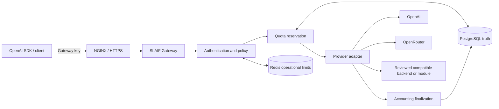

<div align="center">
  <a href="https://www.slaif.si">
    
  </a>
</div>

# SLAIF API Gateway

<div align="center">

[](https://github.com/ulfe-lmi/slaif-api-gateway/actions/workflows/ci.yml)
[](https://github.com/ulfe-lmi/slaif-api-gateway/actions/workflows/codeql.yml)
[](https://www.python.org/)
[](LICENSE)

**A self-hosted, OpenAI-compatible access, policy, and usage control plane for
SMEs, institutions, and bounded teams.**

</div>

SLAIF API Gateway is an organizational AI access control plane that gives
ordinary OpenAI SDK clients a gateway-issued key while
keeping upstream provider credentials on the server. Operators control which
providers, models, endpoints, and capabilities each key may use. PostgreSQL is
the authoritative quota and accounting store; Redis provides operational rate
and concurrency limiting.

> [!IMPORTANT]
> The current project is a credible **RC-beta foundation**, not a production,
> security, compliance, or SLA certification. The current SME MVP assumes one organization per deployment.
> See the [product boundary](docs/product-scope.md)
> and [readiness evidence](docs/beta-readiness.md) before deployment decisions.
> The [RC2 scope matrix](docs/rc2-feature-scope.md) is a target-classification
> contract, not proof that every OpenAI feature is implemented.

## What it provides

| Capability | Current behavior |
|---|---|
| OpenAI-compatible ingress | Standard `OPENAI_API_KEY` and `OPENAI_BASE_URL`; OpenAI-shaped requests, responses, SSE, and errors for the supported subset. |
| Server-side provider isolation | Gateway credentials are replaced with configured OpenAI, OpenRouter, module, or reviewed OpenAI-compatible backend credentials. |
| Per-key policy | Explicit model, endpoint, capability, tool, quota, rate, concurrency, validity, and lifecycle controls. Unknown or unsupported input fails closed. |
| PostgreSQL accounting | Admission reservation, terminal finalization/release, usage and EUR cost metadata, bounded overrun behavior, and operator reconciliation. |
| Operator surfaces | Typer CLI and a server-rendered admin dashboard for keys, providers, routes, pricing, FX, usage, audit, and delivery workflows. |
| Self-hosted appliance | Development Compose and a separate production-style PostgreSQL/Redis/API/NGINX topology with file-backed secrets and explicit migrations. |

## Architecture



Prompts, completions, uploaded media, raw provider bodies, and reasoning content
are not stored by default. Durable records contain bounded operational,
routing, token, cost, and audit metadata.

## Supported API families

| Endpoint family | Support level |
|---|---|
| `GET /v1/models` | Local, key-filtered model catalog |
| `POST /v1/chat/completions` | Bounded text and explicitly route-enabled multimodal/local-tool subsets; non-streaming and SSE |
| `POST /v1/responses` | Bounded text/local-tool/stored-reference subsets, Conversations, input-token count, compact, and one separately fenced OpenAI `web_search` path |
| `POST /v1/audio/*` | Bounded speech, transcription, and translation subsets |
| `POST /v1/embeddings` | Bounded standalone embeddings subset |
| `POST /v1/realtime/client_secrets` | Bounded direct-provider WebRTC admission subset |

This is not a promise of every OpenAI API or field. Consult the
[compatibility matrix](docs/compatibility-matrix.md),
[OpenAI contract](docs/openai-compatibility.md), and
[Responses contract](docs/responses-compatibility.md) for exact accepted,
mutated, and rejected behavior.

## Quick local start

Requirements: Docker with Compose, Git, and free local ports for the configured
services.

```bash
git clone https://github.com/ulfe-lmi/slaif-api-gateway.git
cd slaif-api-gateway
cp .env.example .env

docker compose up -d postgres redis mailpit
docker compose run --rm api slaif-gateway db upgrade
docker compose up -d api worker scheduler

curl --fail http://localhost:8000/healthz
curl --fail http://localhost:8000/readyz
```

Create the first local administrator without putting a password in shell
history:

```bash
docker compose run --rm api slaif-gateway admin create \
  --email admin@example.org \
  --display-name "Gateway administrator" \
  --password-stdin
```

Provider, route, pricing, owner, and gateway-key setup is deliberately explicit.
Continue with the [first-time quickstart](docs/quickstart.md). Production-style
deployment uses a separate [production Compose guide](docs/deployment-production.md),
not the development `.env` workflow above.

## Use it with the OpenAI client

Clients use the standard OpenAI variables. `OPENAI_API_KEY` contains a
**gateway-issued** key, never the real upstream OpenAI key.

```bash
export OPENAI_API_KEY="sk-slaif-..."
export OPENAI_BASE_URL="http://localhost:8000/v1"
```

```python
from openai import OpenAI

client = OpenAI()
response = client.chat.completions.create(
    model="your-approved-model",
    messages=[{"role": "user", "content": "Hello"}],
)
print(response.choices[0].message.content)
```

```python
stream = client.responses.create(
    model="your-approved-model",
    input="Summarize this in one sentence.",
    stream=True,
)
for event in stream:
    if event.type == "response.output_text.delta":
        print(event.delta, end="")
```

## Documentation

Start at the [documentation home](docs/README.md).

| If you are… | Read… |
|---|---|
| Evaluating product scope | [Product scope](docs/product-scope.md), [current readiness](docs/beta-readiness.md), and [compatibility matrix](docs/compatibility-matrix.md) |
| Deploying or operating | [Quickstart](docs/quickstart.md), [configuration](docs/configuration.md), [production deployment](docs/deployment-production.md), and [runbooks](docs/runbooks/README.md) |
| Integrating a client | [OpenAI compatibility](docs/openai-compatibility.md), [Responses compatibility](docs/responses-compatibility.md), and [forwarding contract](docs/provider-forwarding-contract.md) |
| Reviewing controls | [Security model](docs/security-model.md), [accounting](docs/accounting.md), and [database schema](docs/database-schema.md) |
| Contributing or verifying | [Test parallelism](docs/testing-parallelism.md), [HPC testing](docs/testing-hpc.md), and [verification records](docs/verification/README.md) |

## Security and accounting boundaries

- Gateway keys are stored as HMAC digests; plaintext is delivered once at
  creation or rotation.
- Provider configurations store secret environment-variable names, not provider
  key values.
- Unknown pricing or required FX data fails closed for cost-limited requests.
- PostgreSQL row locks and reservation counters enforce durable quota state.
- Redis failures follow configured fail-closed operational policy but never
  become financial truth.
- One admitted request can exceed its estimate; finalized usage is authoritative
  for following-request decisions. This is not exact pre-call spend containment
  or invoice-grade billing.
- The exact bounded OpenAI Responses `web_search` path is opt-in and fenced.
  Other hosted tools, MCP/connectors, file search, code interpreter, computer
  use, and provider-side authority remain denied unless separately documented.

Report vulnerabilities privately as described in [SECURITY.md](SECURITY.md).
Never place provider keys, gateway keys, session secrets, database credentials,
or request content in issues, logs, screenshots, or audit reasons.

## Development and verification

```bash
python -m pip install -e ".[dev]"
python -m pytest tests/unit
python -m ruff check app tests
alembic heads
docker compose config --quiet
```

CI also runs PostgreSQL integration tests, mocked official-client E2E tests,
Playwright browser smoke, Docker Compose smoke, CodeQL, and documentation
hygiene. Green CI is necessary but is not production certification.

## Project and support

- License: [Apache License 2.0](LICENSE)
- Security reporting: [SECURITY.md](SECURITY.md)
- Releases: [release archive](docs/releases/README.md)
- Changes on `main`: [changelog](CHANGELOG.md)
- Operational support boundary: [support policy](docs/support-policy.md)
- Project website: [slaif.si](https://www.slaif.si)

Maintainers: Janez Perš and Jon Muhovič, Laboratory for Machine Intelligence,
Faculty of Electrical Engineering, University of Ljubljana.

We acknowledge support from the EC/EuroHPC JU and the Slovenian Ministry of
Higher Education, Science and Innovation through SLAIF (grant 101254461).
