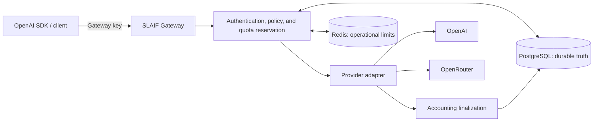

<div align="center">
  <a href="https://www.slaif.si">
    
  </a>
</div>

# SLAIF API Gateway

<div align="center">

[](https://github.com/ulfe-lmi/slaif-api-gateway/actions/workflows/ci.yml)
[](https://github.com/ulfe-lmi/slaif-api-gateway/actions/workflows/codeql.yml)
[](https://www.python.org/)
[](LICENSE)

**A self-hosted, OpenAI-compatible organizational AI access control plane.**

</div>

SLAIF API Gateway puts your organization in control of AI access. It issues
its own API keys, enforces per-key policy and hard quota/accounting, and
forwards permitted requests to upstream providers such as OpenAI and
OpenRouter — while provider credentials stay server-side. Your users and
applications keep using the standard OpenAI Python client with no code
changes beyond two environment variables. The current deployment model
assumes one organization per self-hosted deployment.

## Get started

- **[QUICKSTART.md](QUICKSTART.md)** — boot the Gateway with no provider
  credentials, log in as admin, and make your first OpenAI-client request in
  one sitting.
- **[INSTALL.md](INSTALL.md)** — installation overview: prerequisites,
  persistence, the production-style topology, upgrades, and stop/cleanup
  semantics.

```bash
export OPENAI_API_KEY="sk-slaif-..."          # a gateway-issued key
export OPENAI_BASE_URL="https://api.example.org/v1"

from openai import OpenAI
client = OpenAI()
```

## How it works



A request is admitted only if the gateway key is active and the key's policy
allows the endpoint, model, and capability. PostgreSQL reserves quota before
forwarding and finalizes usage afterward; provider credentials are
substituted server-side and never reach the client.

## Why SLAIF

| Benefit | What it means for you |
|---|---|
| Provider credentials stay server-side | Users hold gateway-issued keys only; upstream keys never leave the server. |
| Per-key policy and hard quotas | Explicit model, endpoint, capability, quota, rate, and validity controls per key; unknown or unsupported input fails closed. |
| Durable accounting | PostgreSQL is the authoritative store for reservations, usage, and EUR cost metadata, with operator reconciliation surfaces. |
| OpenAI client compatibility | Standard `OPENAI_API_KEY`/`OPENAI_BASE_URL` usage with OpenAI-shaped requests, responses, SSE streaming, and errors for the supported endpoint set. |
| Audit and operator surfaces | Immutable audit records, usage and audit exports, plus a server-rendered admin dashboard and CLI for keys, providers, routes, pricing, and delivery workflows. |
| Self-hosted control | Docker Compose deployment you operate; one organization per deployment; prompts and completions are not stored by default. |

The supported endpoint set is bounded and documented exactly in the
[compatibility matrix](docs/compatibility-matrix.md); the product
boundary, including what SLAIF is not, is the
[product scope](docs/product-scope.md).

## Supported API families

| Endpoint family | Support level |
|---|---|
| `GET /v1/models` | Local, key-filtered model catalog |
| `POST /v1/chat/completions` | Bounded text and explicitly route-enabled multimodal/local-tool subsets; non-streaming and SSE |
| `POST /v1/responses` | Bounded text/local-tool/stored-reference subsets, Conversations, input-token count, compact, and one separately fenced OpenAI `web_search` path |
| `POST /v1/audio/*` | Bounded speech, transcription, and translation subsets |
| `POST /v1/embeddings` | Bounded standalone embeddings subset |
| `POST /v1/realtime/client_secrets` | Bounded direct-provider WebRTC admission subset |

This is not a promise of every OpenAI API or field. The
[compatibility matrix](docs/compatibility-matrix.md) and the
[OpenAI](docs/openai-compatibility.md) /
[Responses](docs/responses-compatibility.md) contracts define exact
accepted, mutated, and rejected behavior; the canonical implemented /
explicitly deferred / unsupported-by-policy classification is the
[RC2 feature scope](docs/rc2-feature-scope.md).

## Task navigation

| If you want to… | Start here |
|---|---|
| Boot it and try it | [QUICKSTART](QUICKSTART.md) → [first-time operator guide](docs/first-time-operator-guide.md) |
| Install or upgrade | [INSTALL](INSTALL.md) → [development deployment](docs/deployment.md) / [production deployment](docs/deployment-production.md) |
| Configure it | [configuration reference](docs/configuration.md) |
| Integrate a client | [compatibility matrix](docs/compatibility-matrix.md) → [OpenAI compatibility](docs/openai-compatibility.md) → [provider forwarding contract](docs/provider-forwarding-contract.md) |
| Operate it | [operator runbooks](docs/runbooks/README.md) → [backup and restore](docs/backup-restore.md) → [upgrade runbook](docs/upgrade-runbook.md) |
| Review security and accounting | [security model](docs/security-model.md) → [accounting](docs/accounting.md) → [database schema](docs/database-schema.md) |
| Contribute | [CONTRIBUTING](CONTRIBUTING.md) |
| Read everything | [documentation home](docs/README.md) |

## Security and accounting boundaries

- Gateway keys are stored as HMAC digests; plaintext is delivered once at
  creation or rotation.
- Provider configurations store secret environment-variable names, not
  provider key values.
- Unknown pricing or required FX data fails closed for cost-limited requests.
- PostgreSQL row locks and reservation counters enforce durable quota state;
  Redis failures follow configured fail-closed operational policy but never
  become financial truth.
- One admitted request can exceed its estimate; finalized usage is
  authoritative for following-request decisions. This is not exact pre-call
  spend containment or invoice-grade billing.
- The exact bounded OpenAI Responses `web_search` path is opt-in and fenced.
  Other hosted tools, MCP/connectors, file search, code interpreter,
  computer use, and provider-side authority remain denied unless separately
  documented.

Report vulnerabilities privately as described in [SECURITY.md](SECURITY.md).
Never place provider keys, gateway keys, session secrets, database
credentials, or request content in issues, logs, screenshots, or audit
reasons.

## Project status

SLAIF API Gateway is an **RC-beta foundation**: a credible, verified base for
the supported scope — not a production, security, compliance, or SLA
certification. The current SME deployment model is one organization per
deployment; enterprise tenancy, SSO/RBAC, and multi-organization isolation are
documented non-goals, not missing features you can toggle on. Dated
verification evidence and the exact boundary documents live in the
[verification index](docs/verification/README.md), the
[product scope](docs/product-scope.md), and the
[release archive](docs/releases/README.md).

## License and project

- License: [Apache License 2.0](LICENSE)
- Security reporting: [SECURITY.md](SECURITY.md)
- Changes on `main`: [changelog](CHANGELOG.md)
- Operational support boundary: [support policy](docs/support-policy.md)
- Project website: [slaif.si](https://www.slaif.si)

Maintainers: Janez Perš and Jon Muhovič, Laboratory for Machine Intelligence,
Faculty of Electrical Engineering, University of Ljubljana.

We acknowledge support from the EC/EuroHPC JU and the Slovenian Ministry of
Higher Education, Science and Innovation through SLAIF (grant 101254461).
